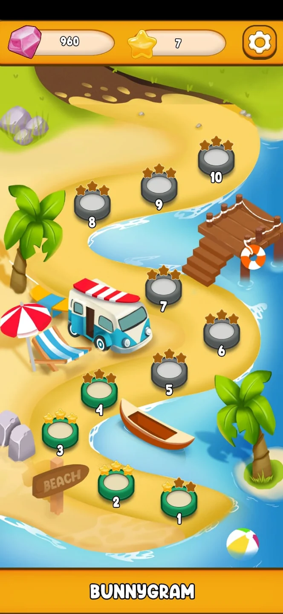
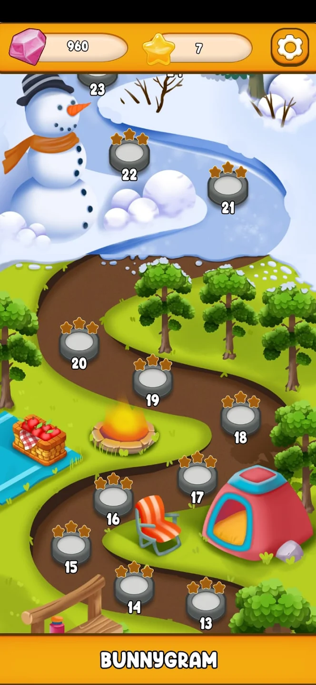
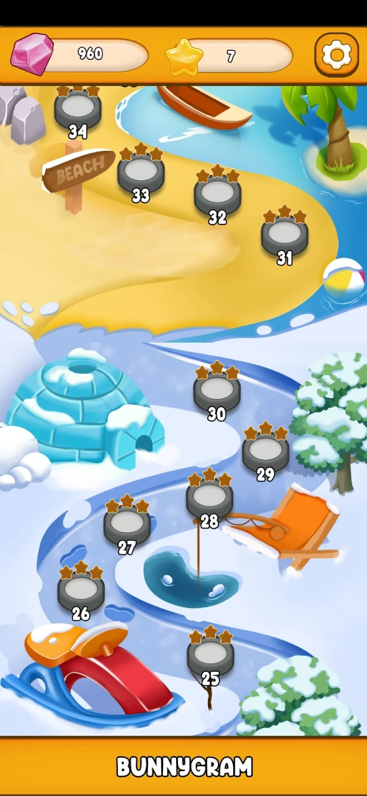
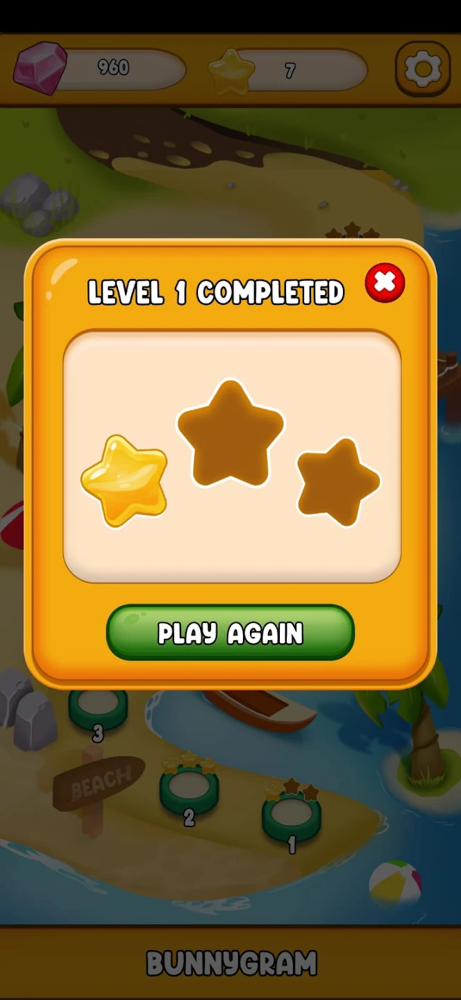
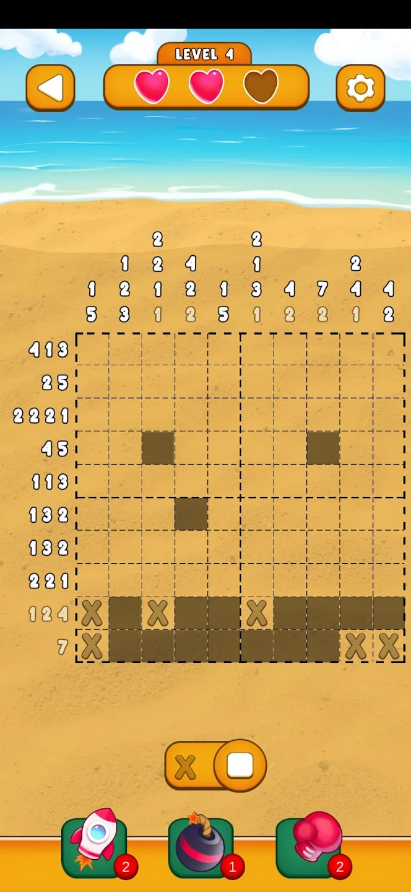
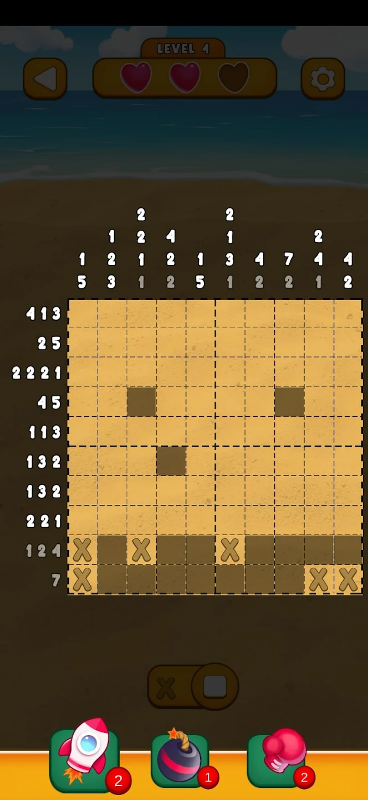
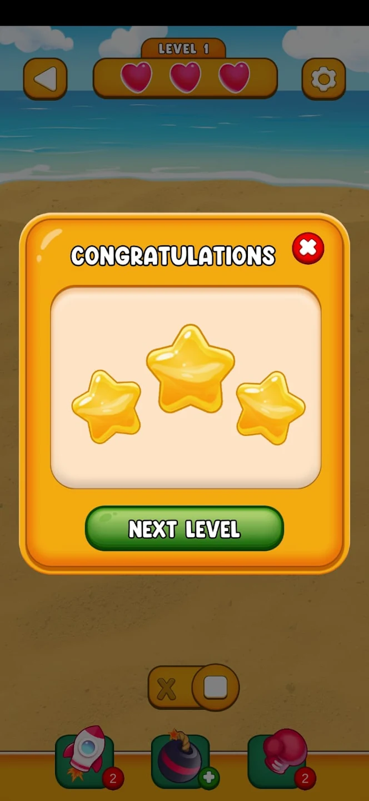

Play Store Link: https://play.google.com/store/apps/details?id=com.LibraInterns.Bunnygram

This a Nonogram-like puzzle game with extra features. \
There are 3 different powerups to use in-game. Each powerup has its unique ability to open up cells on the grid. \
You can buy these powerups with diamonds you earn at each successful level. \
\
This game is developed in 1 month time period. \
It is developed during my internship at the Libra Softworks.

                          CREDITS
                          
DEVELOPERS: \
Emre Sezer \
Atakan Özkan \
Taha Tüfekçi \
\
ARTISTS: \
Dilara Toplu \
Hande Hatice Yılmaz  

